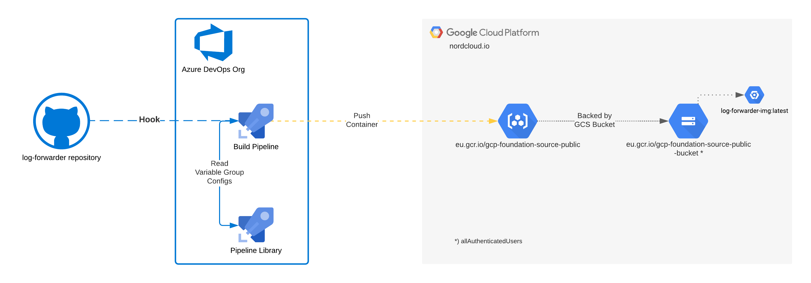

# Azure DevOps Integration
This folder consists all the resources related to [Azure DevOps](dev.azure.com) integration, that is mainly used as way to build the Docker container that serves the Golang application.

## Pipelines
The following pipeline implementation is in place to build & publish the underlying Docker container on frequent interval.
<figure>
    
    <figcaption>
        <b>CI/CD Build Pipeline for Azure DevOps</b>
    </figcaption>
</figure>