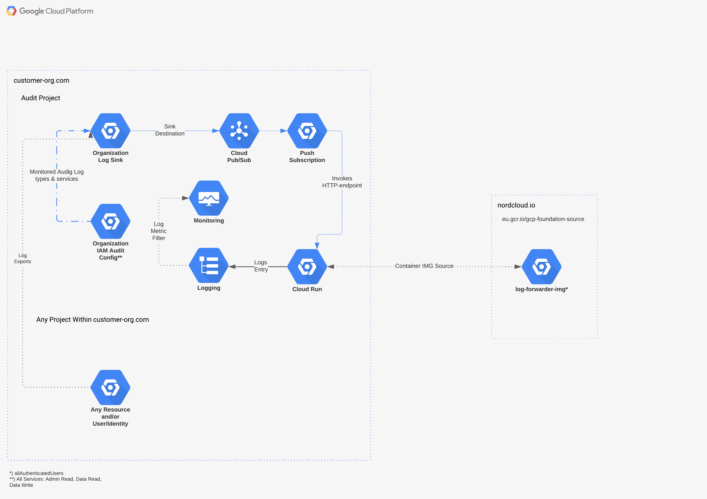

# log-forwarder

Golang based application to consume exported Cloud Logging entries via Pub/Sub subscription and log the entries on configured, central GCP Project.

<figure>
    
    <figcaption alighn="center">
        <b>Recommended Google Cloud Platform Architecture to host the Log Forwarder instance</b>
    </figcaption>
</figure>

## Purpose

The implemented application adds support to globally monitored [Log Metric filters](https://cloud.google.com/logging/docs/logs-based-metrics) for e.g. CIS Compliance reasons, where native solutions on [Google Cloud Platform](console.cloud.google.com) currently does not support this.

The native options in GCP are either to deploy same metric filters on each project within an organization and centralize the monitoring of these filters or export logs to central [Log Buckets](https://cloud.google.com/logging/docs/buckets) and monitor entries manually within **GCP Console**.

Neither of these solutions scales and are hard to maintain, so the approach taken here will deploy server application, ideally hosted on [Cloud Run](https://cloud.google.com/run/docs), that will consume globally (_on organization level_) exported Cloud Logging log entries, that have [PubSub](https://cloud.google.com/pubsub/docs) as their destination sink. Cloud Run instance then gets invoked each time new exported log entry is written to PubSub -topic and writes it using [Cloud Logging APIs](https://cloud.google.com/logging/docs/setup/go) to write them as custom entries on single project.

This same project can then specify log metric filters, which in turn can be monitored and alerts can be configured against those filters. This can help to achieve e.g. CIS compliancy, where certain CIS benchmarks should be monitored accross the GCP organization.

## Contribution Guidelines

All contributions to the repository should happen via Pull Requests.
